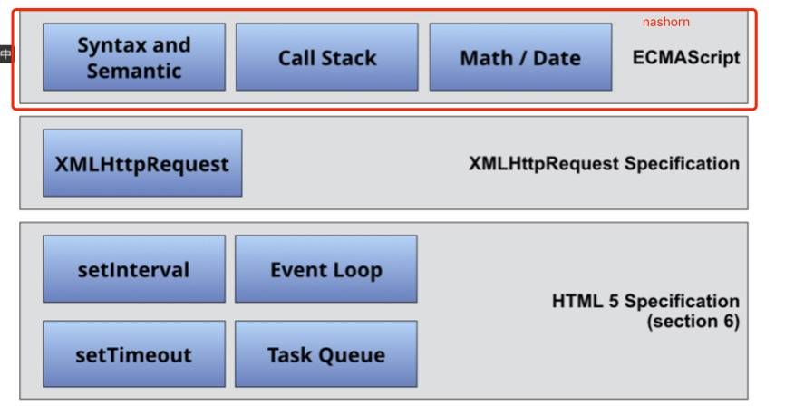

# This is Moqui React SSR (Server-Side Rendering) Add-On Component 

This [Moqui](https://github.com/moqui/moqui-framework) add-on component adds support of [React](facebook.github.io/react) Server Rendering capability to Moqui. 

You may try the [demo](https://github.com/shendepu/moqui-react-ssr-demo)

# Desgin 

- Use Nashorn rendering react app in JVM
- Support multiple apps, each app should have a unique name. 
- All apps share one Nashorn Engine to render all requests
- Support multi-threads of rendering with isolated global bindings. 
- Use [Apache Common Pool](https://commons.apache.org/proper/commons-pool/) to pool Nashorn ScriptContext bindings instead of creating one per render
- Can configure library js to run once when creating ScriptContext. It boosts performance and reduces memory footprint dramatically. But it should be used only when app js don't pollute global.

# Performance 

Run [demo](https://github.com/shendepu/moqui-react-ssr-demo) which configure libaray js only run once.

```
$ ab -n 200 -c 70 http://localhost:8080/apps/react-ssr-demo/counter
This is ApacheBench, Version 2.3 <$Revision: 1748469 $>
Copyright 1996 Adam Twiss, Zeus Technology Ltd, http://www.zeustech.net/
Licensed to The Apache Software Foundation, http://www.apache.org/

Benchmarking localhost (be patient)
Completed 100 requests
Completed 200 requests
Finished 200 requests


Server Software:        Jetty(9.3.14.v20161028)
Server Hostname:        localhost
Server Port:            8080

Document Path:          /apps/react-ssr-demo/counter
Document Length:        2198 bytes

Concurrency Level:      70
Time taken for tests:   7.648 seconds
Complete requests:      200
Failed requests:        0
Total transferred:      519589 bytes
HTML transferred:       439600 bytes
Requests per second:    26.15 [#/sec] (mean)
Time per request:       2676.838 [ms] (mean)
Time per request:       38.241 [ms] (mean, across all concurrent requests)
Transfer rate:          66.34 [Kbytes/sec] received

Connection Times (ms)
              min  mean[+/-sd] median   max
Connect:        0    1   0.9      0       3
Processing:  1530 2518 500.6   2648    3572
Waiting:     1529 2517 500.5   2648    3572
Total:       1530 2519 500.9   2648    3574
WARNING: The median and mean for the initial connection time are not within a normal deviation
        These results are probably not that reliable.

Percentage of the requests served within a certain time (ms)
  50%   2648
  66%   2810
  75%   2938
  80%   2982
  90%   3132
  95%   3194
  98%   3354
  99%   3494
 100%   3574 (longest request)

```

# Requirement for React App

The react app should support server-side rendering. and app should not pollute Javascript global.

## Javascript Polyfills for Nashorn

Nashorn only implements EMACScript, but client-side javascript app may use Browser capability 



This component has already added polyfills for XMLHttpRequest (Not complete version, but can work with fetch) and HTML 5 Specification (Section 6)

The client-side javascript app would need to polyfill `promise` and `fetch` on global if it used them. 
 
## Variables 

- `__APP_BASE_PATH__`: defines the react app base path. In some cases, base path might not be `/`, so react router should prepend `__APP_BASE_PATH__` in root route.
- `__IS_SSR__`: when rendered in nashorn, `__IS_SSR__ = true` is injected in global, so react app could use `window.__IS_SSR__` to tell it is rendered on server
- `__REQ_URL__`: the request Url injected in global, it is the HttpServletRequest URI except protocol, domain and port part. React router should use it for SSR route logic.      

## Result of Render
Result is a map with two keys 

- `html`: server render string of html 
- `state`: redux store state rendered by server

The index.html should be rendered on server with use of `html` and `state` to accomplish server side rendering.

## Boilerplate of SSR App  

### React Redux Starter Kit
You may use customized version of [React Redux Starter Kit](https://github.com/shendepu/react-redux-starter-kit/tree/moqui-react-ssr) which add SSR support.
 
### Although this component name contains React, it may be used by other single page app technologies like Angular JS, but only React app is tested.    

# Reference 

[Should I use a separate ScriptEngine and CompiledScript instances per each thread?](http://stackoverflow.com/a/30159424)
https://github.com/winterbe/spring-react-example 

# License

Moqui React SSR is [CC0-licensed](./LICENSE.md). we also provide an addition [copyright and patent grant](./AUTHORS) 